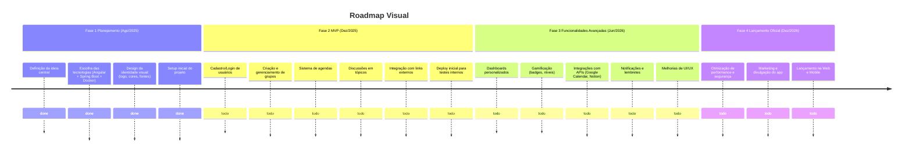

# The Rogue Dev

 

**The Rogue Dev** é um aplicativo inovador que une **gamificação** com **aprendizado colaborativo em grupo**, inspirado nos jogos roguelike! Aqui, repetir tarefas e desafios não é punição, mas o caminho para a evolução! Conforme você e sua equipe completam missões, acumulam pontos, desbloqueiam níveis e badges, transformando o estudo e o desenvolvimento de projetos em uma aventura épica. Crie grupos pequenos, organize agendas, discuta tópicos, compartilhe recursos e acompanhe o progresso coletivo em dashboards motivadores. 
Perfeito para comunidades de estudo, bootcamps ou times de devs que querem aprender enquanto se divertem.

Novo app para comunidades de estudo: crie grupos pequenos, organize agendas, discuta tópicos, compartilhe links e acompanhe dashboards de contribuições. Colaboração e aprendizado em um só lugar!

## ✨ O que você vai encontrar:
- 👥 **Criação de grupos pequenos** (5–15 pessoas)  
- 🗓️ **Agendas semanais e diárias**  
- 💬 **Discussões em tópicos organizados**  
- 🔗 **Links centralizados** (Discord, GitHub, LinkedIn, etc.)  
- 📊 **Dashboards com contribuições e destaques** para cada comunidade/projeto  

## 🎯 Objetivo
Fortalecer comunidades de aprendizado, oferecendo **organização**, **colaboração** e **motivação** em um só lugar, além de possibilitar **networking** entre os participantes. Construa comunidades enxutas focadas no desenvolvimento de projetos **isolados para estudo**! Com elementos roguelike, cada ciclo de tarefas repetidas leva a melhorias permanentes, como upgrades em habilidades e recompensas coletivas.

## 🛠️ Stacks Tecnológicas
- **Frontend:** Angular  
- **Backend:** Spring Boot (Java)  
- **Outros:** Docker para containerização  

## 📌 Roadmap do Projeto

### ✅ Fase 1: Planejamento e Estruturação (Ago/2025)
- [x] Definição da ideia central do aplicativo
- [x] Escolha das tecnologias principais (Angular + Spring Boot + Docker)
- [x] Design inicial da identidade visual (logo, cores, fontes)
- [x] Criação do repositório e setup inicial do projeto

### 🚀 Fase 2: MVP (Produto Mínimo Viável) (Jan/2026)
- [ ] Cadastro e login de usuários
- [ ] Criação e gerenciamento de grupos
- [ ] Sistema básico de agendas semanais/diárias
- [ ] Discussões em tópicos
- [ ] Integração com links externos (GitHub, Discord, LinkedIn)
- [ ] Deploy inicial para testes internos

### 🔥 Fase 3: Funcionalidades Avançadas (Jun/2026)
- [ ] Dashboards personalizados com contribuições
- [ ] Gamificação (badges, níveis de contribuição, mecânicas roguelike como "runs" de tarefas)
- [ ] Integração com APIs externas (Google Calendar, Notion)
- [ ] Notificações e lembretes
- [ ] Melhorias de UI/UX

### 🌐 Fase 4: Lançamento Oficial (Dez/2026)
- [ ] Otimização de performance e segurança
- [ ] Marketing e divulgação do app
- [ ] Lançamento na web e possível versão mobile

## 🗺️ Roadmap Visual

## Como Contribuir
Estamos abertos a contribuições! Fork o repositório, crie uma branch para sua feature ou fix, e envie um pull request. Certifique-se de seguir as boas práticas de código e adicionar testes onde possível.

## Licença
Este projeto está licenciado sob a MIT License - veja o arquivo [LICENSE](LICENSE) para detalhes.

## Contato
- **Autor:** LeonidasBE
- **Email:** theroguedevapp@gmail.com

Vamos evoluir juntos como em um roguelike: cada tentativa nos torna mais fortes! 🚀

## [JIRA DO PROJETO](https://leonidasbestevam.atlassian.net/jira/software/projects/ROGUE/boards/1?atlOrigin=eyJpIjoiNTBmMWU1YWU4ZWM0NDU3MDg3Zjg5ZDM0NWYxZDFjYmIiLCJwIjoiaiJ9)
